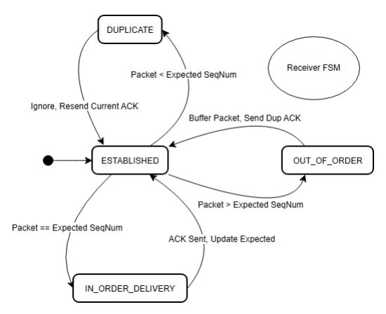

# TCP-Like Protocol Simulation (Option C)

This project simulates a reliable transport protocol (TCP) featuring a Sliding Window, Cumulative ACKs, Single Retransmission Timer, and Fast Retransmit logic. It uses a graphical interface to visualize packet flow and packet loss recovery.

## Protocol State Machines

Below are the Finite State Machine (FSM) diagrams illustrating the logic used for the Sender and Receiver in this implementation.

### Sender FSM
*(Handles window management, timeouts, and fast retransmit)*


### Receiver FSM
*(Handles out-of-order buffering and cumulative ACKs)*



## Prerequisites

To run this simulation, you need:

1. **Python 3.x** installed
2. The **Pygame** library installed

To install Pygame, open your terminal or command prompt and run:

```bash
pip install pygame
```

## How to Run

1. Open your terminal or command prompt
2. Navigate to the project folder where the Python files are located
3. Run the following command:

```bash
python tcp_ui.py
```

## File Structure

- `tcp_ui.py`: The main entry point. Handles the configuration menu, the graphical rendering (Pygame), and user input events.
- `sender.py`: Implements the Sender logic, including the sliding window check, retransmission timer, and detection of duplicate ACKs for Fast Retransmit.
- `receiver.py`: Implements the Receiver logic, specifically buffering out-of-order packets and generating cumulative ACKs.
- `channel.py`: Simulates the network link. Handles propagation delay and executes packet loss based on configuration or user interaction.
- `packet.py`: Defines the data structure for segments (Sequence Number, ACK Number, Data).

## How to Use

### Configuration Menu

- **Input Boxes**: Click to edit the Window Size (N), Total Packets (Max 15), Timeout interval, and Propagation Delay.
- **Visual Loss Config**: Click the Sender Boxes (top row) to automatically drop specific Data packets. Click the Receiver Boxes (bottom row) to automatically drop specific ACKs.
- **Start**: Click "START SIMULATION" to begin.

### Simulation Controls

- **SEND NEW**: Click this button to transmit a packet. The button turns gray if the window is full (Flow Control).
- **PAUSE/RESUME**: Toggles the simulation state.
- **KILL PACKET/ACK**: 
  1. Press PAUSE
  2. Click any moving packet in the channel (it will turn GREEN)
  3. Click "KILL PACKET/ACK" to simulate manual packet loss
- **SPEED**: Use "SLOWER" or "FASTER" to adjust the simulation speed in real-time.